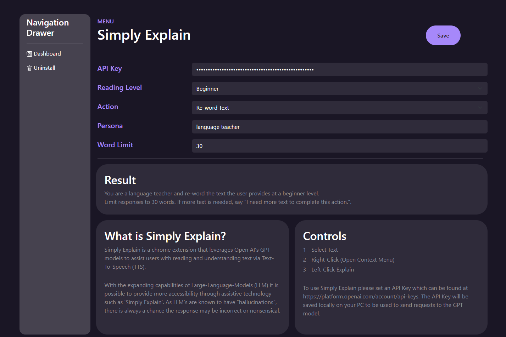
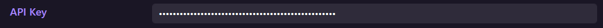
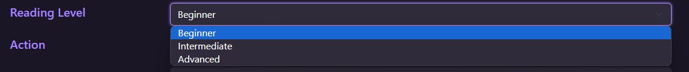
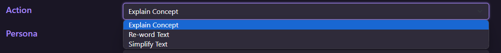
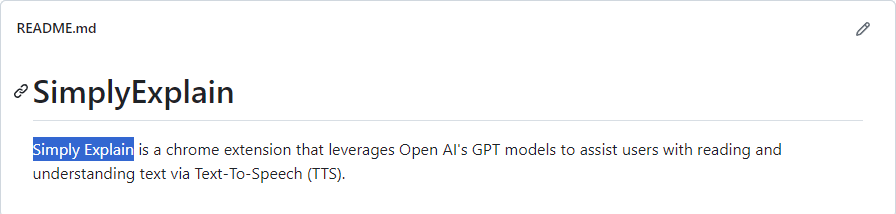
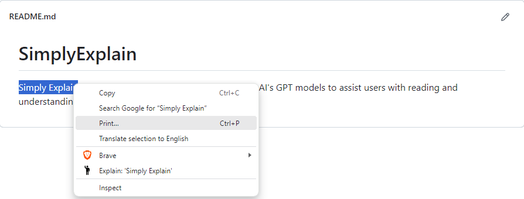

# Simply Explain

*Created by Joshua Crews @ 2023*

Video Demo to be released.

Simply Explain is a chrome extension that leverages Open AI's GPT models to assist users with reading and understanding text via Text-To-Speech (TTS).

With the expanding capabiliites of Large-Language-Models (LLM) it is possible to provide more accessibility through assistive technology such as 'Simply Explain'.
As LLM's are known to have "hallucinations", there is always a chance the response may be incorrect or nonsensical.

## User Flow

### Initial Setup

- Install chrome extension
- Authenticate User
- Open Admin-Panel
    > Here is where you will customize the extension.
    

- Setup API-Key
    > Retrieve this key from your account at OpenAI.

    

- Select Reading Level
    > Changes the complexity of the response.

    

- Select Action
    > Explain, Re-word, and simplify can help you understand text in different ways.

    

- Set Persona
    > A persona relative to the context of the text you are providing will help the LLM leverage the right information to give you a clearer answer.

    

- Set Word-Limit
    > Setting a word limit will save your api tokens and prevent long winded replies.

    

### Usage

- Select Text

    

- Right-Click on text to open context menu to click on "Explain: {selected-text}"
    > Alternatively, press (Mac) Command+Shift+E / (Windows) Ctrl+Shift+E

    
    
- Refine Admin-Panel settings (optional)