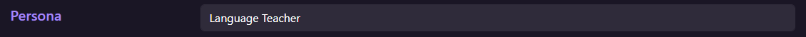
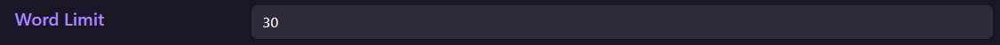

# Simply Explain

*Created by Joshua Crews @ 2023*

Simply Explain is a chrome extension that leverages Open AI's GPT models to assist users with reading and understanding text via Text-To-Speech (TTS).

With the expanding capabiliites of Large-Language-Models (LLM) it is possible to provide more accessibility through assistive technology such as 'Simply Explain'.
As LLM's are known to have "hallucinations", there is always a chance the response may be incorrect or nonsensical.

## Links
- #### [Video Preview](https://youtu.be/Y0qP4W0rAm8)
- #### [Simply Explain Website](https://simply-explain.com)

## User Flow

### Initial Setup

- Install chrome extension
- Authenticate User
- Open Admin-Panel
    > Here is where you will customize the extension.
    

- Setup API-Key
    > Retrieve this key from your account at OpenAI.

    

- Select Reading Level
    > Changes the complexity of the response.

    

- Select Action
    > Explain, Re-word, and simplify can help you understand text in different ways.

    

- Set Persona
    > A persona relative to the context of the text you are providing will help the LLM leverage the right information to give you a clearer answer.

    

- Set Word-Limit
    > Setting a word limit will save your api tokens and prevent long winded replies.

    

### Usage

- Select Text

    

- Right-Click on text to open context menu to click on "Explain: {selected-text}"
    > Alternatively, press (Mac) Command+Shift+E / (Windows) Ctrl+Shift+E

    
    
- Refine Admin-Panel settings (optional)

## Technical

This chrome extension utilizes [Bootstrap v5.3.2](https://getbootstrap.com/docs/5.3/getting-started/introduction/) included within the extension.

Built using the [Chrome Extension API](https://developer.chrome.com/docs/extensions/reference).

Uses [OpenAI's GPT and Text-To-Speech models](https://platform.openai.com/docs/overview)

Icons are [Bootstrap Icons](https://icons.getbootstrap.com/)

### HTML

#### admin-panel.html

- Main options panel for the user.

- Provides access to change all settings/preferences.

#### options.html

- Lightweight options panel for the user.

- Provides access to change all settings/preferences.

#### chat-history.html

- Popup menu containing history of previous interactions.

- Provides access to admin panel.

#### audio-playback.html

- Required to play Text-To-Speech audio retrieved from OpenAI TTS.

### JavaScript

#### service-worker.js

- Background worker handling main functionality of the extension.

- Authenticates user to minimize bot activity.

- Creates Instruction GPT prompt to guide GPT to give the user the desired answer.

- Fetches completion response from GPT model.

- Fetches Text-To-Speech .mp3 audio from TTS Model OR Processes text through chrome.tts.

- Creates audio-playback offscreen document.

- Handles messaging between service-worker and other scripts.

- Directs shortcut commands.

- Pushes notifications to the user with response.

- Updates chat history on use.

#### scroll-container.js

- Creates the usage of the class "scroll-container".

- Used with 2 buttons with id's "down-arrow", "up-arrow".

- Contains multiple elements allowing the user to scroll between them.

#### admin-panel.js

- Provides functionality to the admin-panel.html page.

- Loads/Saves options/preferences to and from chrome.storage.

#### audio-playback.js

- Recieves a message from the service worker containing the base64URLstring for the audio.

- Converts the string to an audio blob.

- Plays the audio back to the user.

#### chat-history.js

- Provides functionality to the chat-history.html page.

- Loads the recent chat history from chrome.storage.

- Updates elements with the history content with newest at the top.

- Allows user to speak the last chat.

### CSS

#### theme.css

- Contains style for theme

#### main.css

- Contains style for elements used in various pages.

#### chat-history.css

- Contains style for elements used in chat-history.html.

### Deployment

- Use UglifyJS to minify and compress Javascript files.
- Zip the folder.
- Upload to Chrome Developer Dashboard.